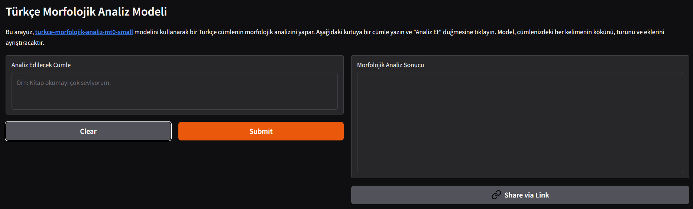
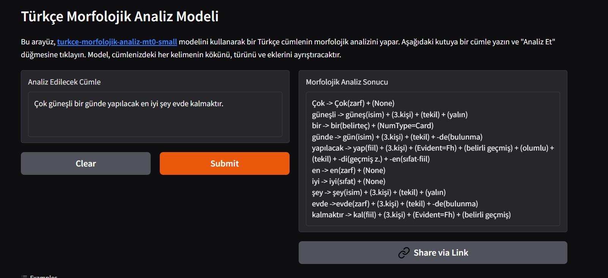

# Türkçe Cümleler için Morfolojik Analiz

[](https://huggingface.co/spaces/obenadak/turkce-morfolojik-analiz)  
[](https://huggingface.co/obenadak/turkce-morfolojik-analiz-mt0-small)  
[](https://opensource.org/licenses/Apache-2.0)

Bu proje, Türkçe cümlelerin derinlemesine morfolojik analizini yapabilen bir **sequence-to-sequence** modeli içerir. Model, `bigscience/mt0-small` temel alınarak `universal_dependencies` (`tr_boun`) veri seti üzerinde ince ayarlanmıştır.

> ### **[İnteraktif Demoyu Buradan Deneyebilirsiniz](https://huggingface.co/spaces/obenadak/turkce-morfolojik-analiz)**

<table>
  <tr>
    <td></td>
    <td></td>
  </tr>
</table>

---

## Projenin Amacı

Model, kendisine verilen bir Türkçe cümledeki her bir kelimeyi alarak aşağıdaki yapısal bilgilere ayrıştırır:

- **Kök (Lemma):** Kelimenin anlam taşıyan en temel hali.  
- **Kelime Türü (Part-of-Speech):** Kelimenin cümledeki görevi (isim, fiil, sıfat vb.).  
- **Ekler (Affixes):** Kelimenin aldığı çekim ve yapım ekleri.

### Örnek Çıktı

**Girdi:**
```
Kitapları masanın üstüne koydum.
```

**Çıktı:**
```
Kitapları -> kitap(isim) + -ler(çoğul) + -i(belirtme) |
masanın   -> masa(isim) + -in(tamlayan) |
üstüne    -> üst(isim) + -e(yönelme) + (3.kişi iyelik) |
koydum    -> koy(fiil) + -di(geçmiş z.) + (1.kişi)
```

---

## Performans

## Değerlendirme Sonuçları (Evaluation Results)

Model, **tr_boun** veri setinin doğrulama (validation) ve test kümelerinde aşağıdaki sonuçları elde etmiştir.

### Final Doğrulama (Validation) Sonuçları
| Metrik | Puan |
|---|---|
| Loss | 0.1605 |
| Rouge1 | 17.8207 |
| Rouge2 | 14.2998 |
| RougeL | 17.6289 |
| Root & POS Accuracy | 0.0564 |
| Affix F1-Score | 0.0643 |
| Word Exact Match | 0.0243 |
| Sentence Exact Match | 0.0000 |
| Runtime (s) | 54.1345 |
| Samples / Second | 18.0850 |
| Steps / Second | 2.2720 |

### Test Seti Sonuçları
| Metrik | Puan |
|---|---|
| Loss | 0.1581 |
| Rouge1 | 17.9301 |
| Rouge2 | 14.2752 |
| RougeL | 17.7252 |
| Root & POS Accuracy | 0.0550 |
| Affix F1-Score | 0.0620 |
| Word Exact Match | 0.0232 |
| Sentence Exact Match | 0.0000 |
| Runtime (s) | 53.7059 |
| Samples / Second | 18.2290 |
| Steps / Second | 2.2900 |
| Epoch | 5.0000 |

---

## Eğitim Kodları ve Tekrarlanabilirlik

Bu repoda, modelin farklı versiyonlarını eğitmek için kullanılan Jupyter/Colab notebook'larını bulabilirsiniz.

-   **Versiyon 2 (Final Model - 5 Epoch):** [turkce_morfolojik_analiz_V2.ipynb](./turkce_morfolojik_analiz_V2.ipynb) 
    Modelin 5 epoch boyunca eğitildiği, ROUGE use_stemmer=False olarak güncellendiği, en son ve en iyi performansa sahip versiyonun kodları. Hugging Face Hub'daki ana model bu notebook ile eğitilmiştir.

-   **Versiyon 1 (İlk Deney - 3 Epoch):** [turkce_morfolojik_analiz_V1.ipynb](./turkce_morfolojik_analiz_V1.ipynb) 
    Modelin 3 epoch ile eğitildiği ilk deneme. Model geliştirme sürecini ve daha uzun eğitimin etkisini görmek için referans olarak tutulmaktadır.


*Not:* Detaylı eğitim süreci ve hiperparametreler için [model kartına](https://huggingface.co/obenadak/turkce-morfolojik-analiz-mt0-small) bakınız.

---

## Kurulum ve Kullanım

Projeyi yerel makinenizde çalıştırmak için aşağıdaki adımları izleyebilirsiniz.

### Gereksinimler
- Python 3.8+
- Git

### 1. Projeyi Klonlayın
```bash
git clone https://github.com/obenadak/turkce-morfolojik-analiz.git
cd turkce-morfolojik-analiz 
```
### 2. Bağımlılıkları Yükleyin
```bash
pip install -r requirements.txt
```
### 3. Modeli Python İçinde Kullanma
```python
from transformers import pipeline

# Modeli Hugging Face Hub'dan yükle
model_repo = "obenadak/turkce-morfolojik-analiz-mt0-small"
analiz_cihazi = pipeline("text2text-generation", model=model_repo)

# Analiz edilecek cümle
cumle = "Gelecek hafta sonu için planların neler?"

# Analizi gerçekleştir
sonuc = analiz_cihazi(cumle, max_length=512)

print(sonuc[0]['generated_text'])
```
### Katkıda Bulunma
Projeye katkıda bulunmak isterseniz, lütfen bir issue açın veya pull request gönderin.

### Lisans
Bu proje Apache 2.0 Lisansı ile lisanslanmıştır.